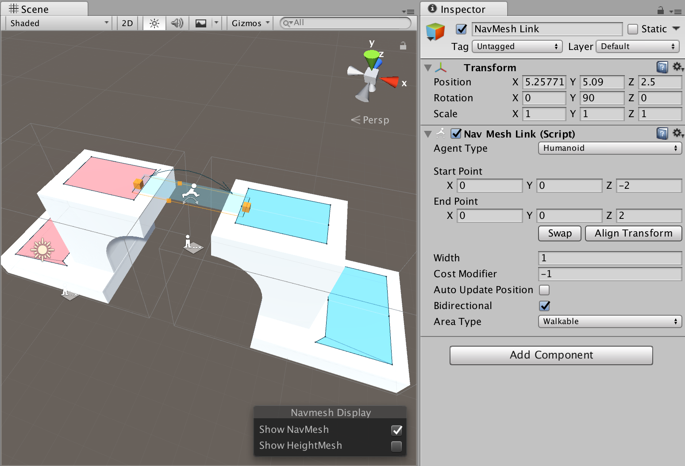

# Connecting NavMesh Surfaces

If it is desired to allow an agent to move along multiple NavMesh Surfaces in a Scene, the surfaces need to be connected together using NavMesh Links.

In the example scene above, the blue and red NavMeshes are defined in different NavMesh Surfaces. A wide NavMesh Link is added, it spans from one surface to another.

Things to keep in mind when connecting surfaces:
* You can connect surfaces using multiple links.
* Both the surfaces and the link must have same agent type.
* The link’s start and end point must be only on one surface. It is OK to have multiple NavMeshes at the same location, but then selecting a NavMesh becomes ambiguous.
* If you are loading a second NavMesh Surface additively and you have “dangling” links in the first scene, check that they do not connect to unwanted surfaces.
