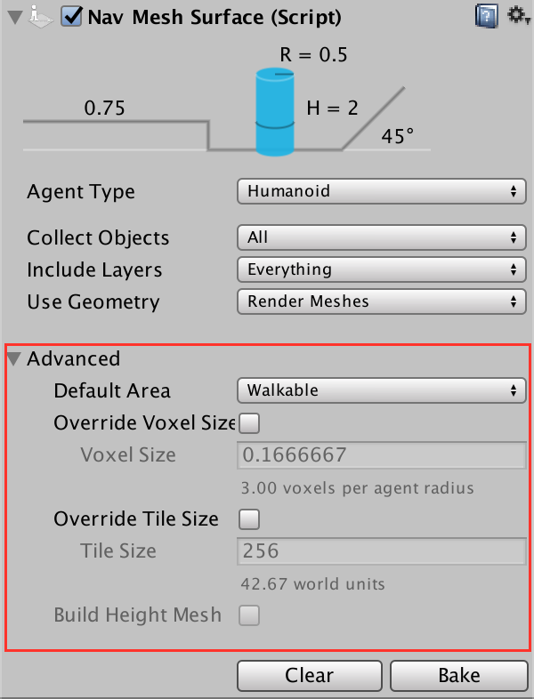

# NavMeshSurface

The NavMeshSurface component represents the walkable area for a specific agent type. The NavMesh Surface component defines a part of the world where a NavMesh should be built. A scene can contain multiple NavMesh Surfaces.

The preferred way to use the NavMeshSurface component is to create an empty Game Object containing the NavMeshSurface component. There’s a menu option for that: GameObject > AI > NavMesh Surface. This creates an empty Game Object with a NavMeshSurface component attached to it.

The NavMeshSurface component can be also added to any game object. This is useful for cases where you want to use the Hierarchy to define which objects contribute to the NavMesh.

## Parameters
* Agent Type – the agent type which will use this NavMesh Surface. The agent type is used for bake settings, as well as to match a NavMeshAgent to proper surface during pathfinding.
* Collect Objects – defines on a high level which objects should be used for baking.
	* All – use all active objects.
	* Volume – use all active objects overlapping the bounding volume (defined later) 
	* Children – use all active objects which are children to the NavMeshSurface component, in addition to the object the component is placed on.
* Include Layers – defines the layers on which the objects must be to be included in the bake. This allows further culling of objects from inclusion in the bake e.g. effects or animated characters.
* Use Geometry – selects which geometry is used for baking.
* Render Meshes – use geometry from rendered meshes and terrains
* Physics Colliders – use geometry from colliders and terrains. When using physics this is usually a better option than Render Meshes. This way the agents will be closer to the physical bounds of the environment.

The main settings for the NavMesh Surface component allow you to filter the input geometry on a broad scale. To fine tune how input geometry is treated on a per-object level when building a navmesh, see NavMeshModifer component.

Game Objects which have a NavMesh Agent or NavMesh Obstacle will be excluded from the baking process automatically. They are dynamic users of the navmesh – and hence should not contribute to the navmesh building.

## Advanced Settings

The main settings will cater for most use cases, but for anything not covered by the main settings, the advanced section has the following additional parameters

* Default Area – defines the area type generated when building the navmesh. The default value is Walkable. The NavMeshModifer component can be used to modify the area type in more detail.
* Override Voxel Size – The override voxel size controls how accurately the input geometry is processed for NavMesh baking. It is a tradeoff between speed and accuracy. A good value to start with is 3 voxels per agent radius (6 per diameter). This allows to capture most of the narrow passages, like doors and still have quick baking. If you have big open areas, you might go down to 1 or 2 to speed things up. Or if you have tight indoor spots, you can use smaller voxels, and use maybe 4-6 voxels per radius. More than 8 is usually not really worth it.   
* Override Tile Size – In order to make the bake process parallel and memory efficient, the world is divided into tiles for baking. The white lines you can see on your NavMesh are tile boundaries. The default tiles size is 256 voxels. It is a good trade-off between memory usage and NavMesh fragmentation. The smaller the tiles are the more fragmented the NavMesh is, and this can sometimes cause non-optimal paths. NavMesh carving also operates on tiles. If you have a lot of obstacles, you can potentially speed up carving by making the tile size smaller, say 64-128. Also, if you plan to bake the NavMesh at runtime, you may choose to use smaller tile size to keep the maximum memory usage low.
* Build Height Mesh – Not supported yet.

